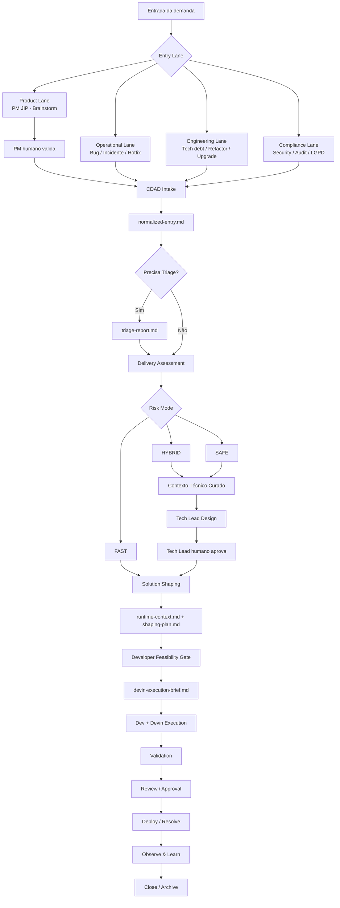

# AI-CDAD Mermaid Flow

```mermaid
flowchart TD
    A[Entrada da demanda] --> B{Entry Lane}
    B --> P[Product Lane<br/>PM JIP - Brainstorm]
    B --> O[Operational Lane<br/>Bug / Incidente / Hotfix]
    B --> E[Engineering Lane<br/>Tech debt / Refactor / Upgrade]
    B --> C[Compliance Lane<br/>Security / Audit / LGPD]
    P --> P1[PM humano valida]
    P1 --> I[CDAD Intake]
    O --> I
    E --> I
    C --> I
    I --> NE[normalized-entry.md]
    NE --> T{Precisa Triage?}
    T -->|Sim| TR[triage-report.md]
    TR --> DA[Delivery Assessment]
    T -->|Não| DA
    DA --> RM{Risk Mode}
    RM --> F[FAST]
    RM --> H[HYBRID]
    RM --> S[SAFE]
    F --> SH[Solution Shaping]
    H --> CTX[Contexto Técnico Curado]
    S --> CTX
    CTX --> TD[Tech Lead Design]
    TD --> TL[Tech Lead humano aprova]
    TL --> SH
    SH --> SP[runtime-context.md + shaping-plan.md]
    SP --> DG[Developer Feasibility Gate]
    DG --> DEB[devin-execution-brief.md]
    DEB --> EXEC[Dev + Devin Execution]
    EXEC --> VAL[Validation]
    VAL --> REV[Review / Approval]
    REV --> DEP[Deploy / Resolve]
    DEP --> OBS[Observe & Learn]
    OBS --> CLOSE[Close / Archive]
```
