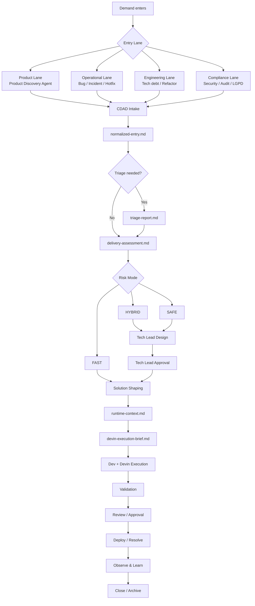

# AI-CDAD — AI Context-Driven Adaptive Delivery

**AI-CDAD** is an enterprise delivery framework for AI-augmented software and data delivery.

It is designed to help teams use AI tools such as **Devin** safely and effectively across:

- greenfield initiatives
- brownfield evolution
- hybrid delivery
- bugs
- incidents
- hotfixes
- technical debt
- refactoring
- compliance and security remediation

---

## Positioning

> **AI-CDAD governs.**  
> **AI-DLC structures the lifecycle.**  
> **AI Execution Agents execute under guidance.**  
> **Humans retain ownership.**

AI-CDAD is not a coding agent.

AI-CDAD is not a replacement for Product, Tech Lead or Developer judgment.

It is an operating model that defines how context, risk, human decisions, artifacts, playbooks and AI-assisted execution work together.

---

## Why this framework exists

AI delivery fails when the model starts coding without enough context.

Common problems:

- AI changes code without understanding business impact.
- Brownfield changes are treated like greenfield work.
- Developers become prompt operators instead of technical owners.
- Tech Leads become bottlenecks reviewing everything.
- Context grows too large and consumes too many tokens.
- Decisions are lost in chat, Teams or PR comments.
- Multiple initiatives modify the same repository without coordination.
- Risks around production, contracts, PII, IAM and rollback are discovered too late.

AI-CDAD solves this by introducing:

- entry lanes
- risk modes
- context lifecycle
- runtime context
- human-in-the-loop gates
- playbooks by role
- policies
- artifact ownership
- minimal runtime context
- evidence-based execution

---

## Core principles

1. **Context before code**  
   AI must understand enough context before execution.

2. **AI drafts, humans own**  
   AI creates artifacts and suggestions. Humans validate critical decisions.

3. **Risk-adaptive delivery**  
   Low-risk work should be fast. Brownfield critical work should be safe.

4. **Minimal runtime context**  
   Repositories store rich memory. AI execution sessions load only what is needed.

5. **Evidence-based trust**  
   Runtime summaries must reference evidence, not rely on unsupported assumptions.

6. **Safe default**  
   If relevant uncertainty exists, increase rigor: FAST → HYBRID → SAFE.

7. **AI Execution Agents are guided, not free-running**  
   AI Execution Agents execute within AI-CDAD policies, playbooks, gates and stop conditions.

---

## Relationship with AWS AI-DLC

AI-CDAD can integrate with **AWS AI-DLC** as the delivery lifecycle structure.

AI-CDAD defines:

- how a demand enters the flow
- how risk is classified
- which playbooks apply
- which artifacts are required
- which humans must approve
- which context is loaded
- when an AI agent must stop

AI-DLC supports execution phases such as:

- Discover
- Design
- Build
- Test
- Deploy
- Observe

In short:

```text
AI-CDAD = governance and operating model
AI-DLC = execution lifecycle
Devin = guided orchestrator
```

---

## PM Agent boundary

The PM Agent already exists outside this framework.

In this model, the PM Agent is called:

```text
Product Discovery Agent
```

It is responsible for:

- product discovery
- requirement elicitation
- inception
- story creation
- acceptance criteria
- prioritization

AI-CDAD does **not** implement the PM Agent.

AI-CDAD starts after a demand enters the framework, either from **Product Discovery Agent** or from another lane such as bug, incident, tech debt or compliance.

---

## Human role boundaries

### PM / Product Discovery Agent

Owns:

- WHAT
- WHY
- VALUE
- PRIORITY
- acceptance criteria
- product context

Does not own technical implementation.

---

### Tech Lead

Owns:

- architectural direction
- technical strategy
- risk acceptance
- contract strategy
- migration strategy
- rollout strategy
- rollback strategy

Tech Lead is not expected to review every line of code.

---

### Developer

Owns:

- technical execution
- implementation feasibility
- edge cases
- tests
- PR readiness
- code quality
- execution with Devin

The Developer is an **AI-Augmented Engineer**, not a prompt operator.

---

### AI / Devin

Accelerates:

- context organization
- artifact drafting
- shaping
- implementation
- testing
- validation
- documentation

AI does not own risk, approvals or final accountability.

---

## Entry Lanes

AI-CDAD supports four entry lanes.

### 1. Product Lane

Used for:

- new features
- product evolution
- business enhancements
- new data products
- modernization with product intent

Usually comes from **Product Discovery Agent**.

---

### 2. Operational Lane

Used for:

- bugs
- incidents
- hotfixes
- alerts
- degraded production behavior

Usually does not require PM discovery.

Requires triage.

---

### 3. Engineering Lane

Used for:

- technical debt
- refactoring
- dependency upgrades
- observability improvements
- performance improvements
- infrastructure evolution

Usually initiated by Tech Lead or Developer.

---

### 4. Compliance Lane

Used for:

- security vulnerabilities
- audit findings
- LGPD/privacy remediation
- regulatory requirements
- secret exposure

Usually defaults to SAFE or HYBRID depending on risk.

---

## Risk Modes

AI-CDAD classifies work into three risk modes.

### FAST

For low-risk work.

Examples:

- isolated greenfield capability
- local bug fix
- small refactor
- no production criticality
- no API/schema/contract change
- no PII
- simple rollback

Governance: lightweight.

---

### HYBRID

For work that combines new delivery with existing systems.

Examples:

- new capability integrated with legacy
- known internal consumers
- limited production impact
- controlled rollout recommended
- moderate technical dependency

Governance: balanced.

---

### SAFE

For high-risk brownfield or critical work.

Examples:

- production-critical capability
- API/schema/event/contract change
- multiple consumers
- PII or sensitive data
- IAM/security changes
- destructive operations
- complex rollback
- migration
- compliance/security remediation
- low AI confidence
- insufficient context

Governance: strong.

---

## Safe default

If relevant uncertainty exists, increase rigor:

```text
FAST → HYBRID → SAFE
```

Examples:

```text
Unknown production impact → treat as potential production impact
Unknown contract impact → require assessment
Unknown data sensitivity → stop and ask
Unknown ownership → stop and ask
```

---

## End-to-end flow

```text
Demand enters
  ↓
Entry Lane identified
  ↓
CDAD Intake
  ↓
normalized-entry.md
  ↓
Triage, if needed
  ↓
delivery-assessment.md
  ↓
FAST / HYBRID / SAFE
  ↓
Technical context, if needed
  ↓
Tech Lead Design
  ↓
Solution Shaping
  ↓
Developer Feasibility Gate
  ↓
runtime-context.md
  ↓
devin-execution-brief.md
  ↓
Dev + Devin execution
  ↓
Validation
  ↓
Review / Approval
  ↓
Deploy / Resolve
  ↓
Observe & Learn
  ↓
Close / Archive
```

---

## Repository model

AI-CDAD uses three repository layers.

---

### 1. `ai-cdad-framework`

This repository contains the reusable framework:

```text
architecture/
playbooks/
policies/
templates/
agent-roles/
prompts/
examples/
docs/
```

Purpose:

```text
How we work.
```

This is the repository you can keep in your personal GitHub first, evolve with Devin, and later adapt for your work environment.

---

### 2. Central community repository

Example:

```text
repo-central-ai-delivery-community
```

This repository contains global context, cross-initiative artifacts and indexes.

Recommended structure:

```text
central-community-repo/
  README.md

  ai-cdad/
    framework-ref.md
    adoption-guide.md
    community-working-agreement.md

  contexts/
    domain/
      glossary.md
      capability-map.md
      business-rules.md
      constraints.md

    products/
      customer-service-platform/
        product-overview.md
        architecture-current-state.md
        integrations.md
        contracts.md
        known-risks.md
        context-index.md

  initiatives/
    active/
      <initiative-id>/
        initiative-overview.md
        original-input.md
        normalized-entry.md
        delivery-assessment.md
        global-impact-analysis.md
        global-lean-sdd.md
        global-shaping-plan.md
        rollout-strategy.md
        approval-record.md
        consolidated-validation-report.md
        consolidated-observability-summary.md
        initiative-repos.md

    archived/
      <initiative-id>/
        initiative-summary.md
        archived-artifacts/

  indexes/
    initiative-registry.md
    repo-impact-index.md
    component-impact-index.md
```

Purpose:

```text
Official memory, cross-repo governance and portfolio visibility.
```

---

### 3. Application repository

This is where code lives.

Recommended structure:

```text
repo-da-aplicacao/
  src/
  tests/
  infra/

  .cdad/
    README.md
    framework-ref.md

    initiatives/
      <initiative-id>/
        initiative-ref.md
        normalized-entry.md
        triage-report.md
        runtime-context.md
        relevant-files-list.md
        local-technical-context.md
        local-impact-analysis.md
        local-design.md
        local-shaping-plan.md
        parallel-execution-plan.md
        ai-execution-brief.md
        devin-execution-brief.md
        validation-report.md
        local-observability-checklist.md
        implementation-notes.md
        pr-summary.md
        cdad-exception-report.md
```

Purpose:

```text
Local execution close to the code.
```

---

## Artifact location strategy

Do not duplicate everything everywhere.

```text
Framework method
→ ai-cdad-framework

Global/cross context
→ central community repository

Local execution
→ application repository
```

Examples:

| Artifact | Location |
|---|---|
| policies | `ai-cdad-framework` |
| templates | `ai-cdad-framework` |
| playbooks | `ai-cdad-framework` |
| product context | central community repo |
| initiative registry | central community repo |
| repo impact index | central community repo |
| runtime-context.md | application repo |
| ai-execution-brief.md | application repo |
| devin-execution-brief.md | application repo when using Devin-specific compatibility |
| validation-report.md | application repo |
| approval-record.md | hub or local, depending on scope |
| initiative-summary.md | hub when archived |

---

## Context and token strategy

AI-CDAD is designed to avoid token bloat.

Main principle:

```text
Repositories store rich memory.
AI execution sessions use minimal runtime context.
```

The primary runtime artifact is:

```text
runtime-context.md
```

It contains:

- goal
- scope
- out of scope
- risk mode
- required gates
- critical constraints
- evidence references
- stop conditions
- human owners
- validation requirements
- relevant files

---

## Token budgets

Recommended budget by mode:

```text
FAST
Target: up to 20k tokens
Max: 40k tokens

HYBRID
Target: up to 50k tokens
Max: 100k tokens

SAFE
Target: up to 100k tokens
Max: 180k tokens
```

If context exceeds the budget, the AI Execution Agent must generate:

```text
context-reduction-plan.md
```

before continuing.

---

## What must never be removed to save tokens

Even when minimizing context, never remove:

- risk mode
- scope
- out of scope
- hard stops
- required gates
- stop conditions
- human owner
- validation requirements
- evidence references

---

## Governance hard stops

AI Execution Agents must stop and request human approval when detecting:

- production change
- API/data contract/schema/event change
- sensitive data / PII
- IAM/security permission change
- destructive operation
- relevant cost impact
- low AI confidence
- SAFE mode without required approvals
- conflict with another active initiative on critical component/contract

Hard stop means:

```text
stop
explain risk
request approval
record decision
continue only if approved or plan adjusted
```

---

## Parallel execution

AI-CDAD supports governed parallel execution.

Parallelism is allowed only when tasks are:

- independent
- scoped
- safe
- validatable

The Workstream Organizer creates:

```text
parallel-execution-plan.md
```

Each workstream must define:

- goal
- owner
- allowed files
- blocked files
- dependencies
- merge order
- validation needs

SAFE mode avoids parallel critical changes in:

- contracts
- schemas
- migrations
- production paths
- IAM
- destructive operations

---

## How to use with Devin

Run prompts in this order:

```text
prompts/devin/00-plan-before-files.md
prompts/devin/01-create-scaffold.md
prompts/devin/02-strengthen-rules.md
prompts/devin/03-architecture-review.md
prompts/devin/04-apply-corrections.md
prompts/devin/05-create-examples.md
prompts/devin/06-final-audit.md
```

Start with:

```text
00-plan-before-files.md
```

Important:

```text
Do not let Devin create files before it explains the plan.
```

---

## Status update format

Every time Devin creates, updates, blocks or asks for approval, it must output:

```markdown
## AI-CDAD Status Update

**Current Stage:**  
<stage>

**Current State:**  
<internal state if applicable>

**Created/Updated Artifacts:**  
- <file> — <location>

**Human Action Required:**  
- <who must do what>

**Blocking Issues:**  
- <if any>

**Next Step:**  
<next action>

**Confidence:**  
High | Medium | Low
```

---

## Adoption path

Recommended adoption:

```text
1. Personal GitHub repo
2. Devin scaffold and review
3. Tabletop tests
4. Central community repo pilot
5. One application repo pilot
6. Local bugfix test
7. HYBRID scenario test
8. SAFE brownfield scenario test
9. Adapt to internal policies
10. Expand to the squad/community
```

---

## First tabletop test

Use this scenario:

```text
A developer found a bug where customer-service-api returns HTTP 500 when correlation_id is null.
```

Expected flow:

```text
Operational Lane
↓
Triage
↓
Delivery Assessment
↓
FAST or SAFE depending on production/contract impact
↓
runtime-context.md
↓
devin-execution-brief.md
↓
Dev + Devin execution
↓
Validation
↓
PR
```

---

## Mermaid overview



---

## Final rule

> PM defines the what.  
> Tech Lead defines safe technical direction.  
> Developer owns execution.  
> AI accelerates.  
> AI-CDAD governs.
